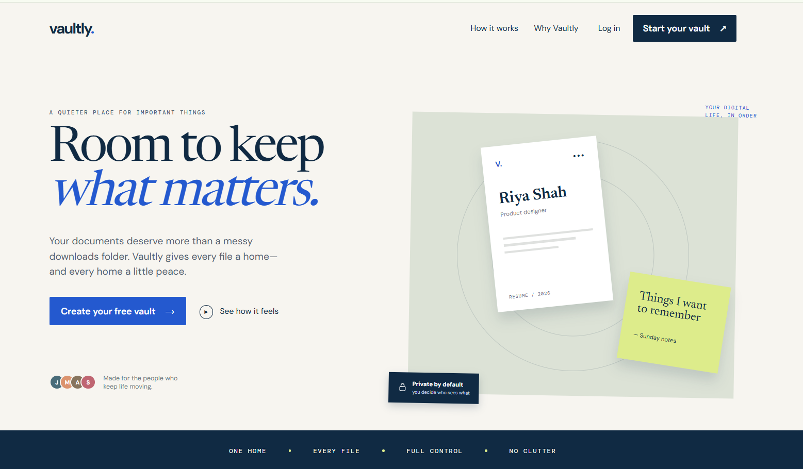
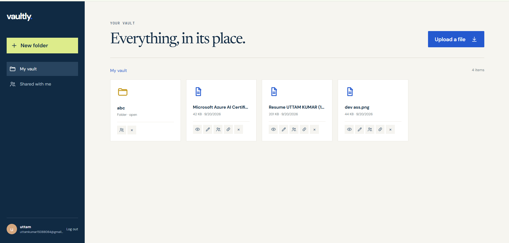
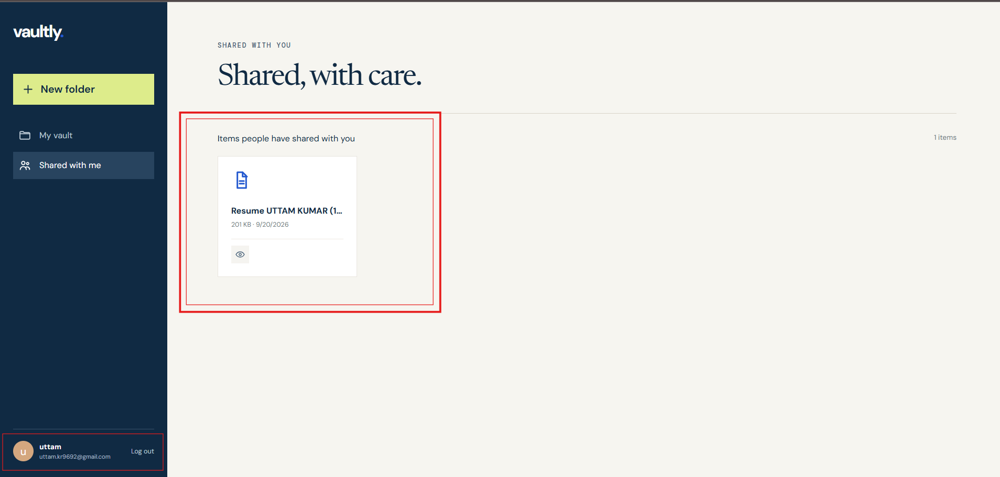

# Cloud File Management & Storage Platform

A backend API for an authenticated personal cloud drive. Users can upload notes, resumes, PDFs, and other files, create and organize folders, move/rename files, download files, and share files or folders with another registered user.

## Stack

- Node.js + Express
- MongoDB for users, folders, file metadata, and sharing permissions
- AWS S3 for storage (or local MinIO during development)
- Redis for five-minute file metadata caching
- JWT + bcrypt password authentication

Uploads up to **150 MB** are accepted by default. The AWS SDK uploader uses 8 MB parts and four parallel workers, giving reliable multipart uploads for large objects.

## Run locally

1. Install Node.js 20+ and Docker Desktop.
2. Copy the example environment file: `Copy-Item .env.example .env`.
3. Start MongoDB, Redis, and MinIO: `docker compose up -d`.
4. Install dependencies: `npm install`.
5. Start the API: `npm run dev`.
6. Open MinIO at `http://localhost:9001` (login: `minioadmin` / `minioadmin`) to inspect objects. The API creates the `cloud-files` bucket on startup.

## Run the frontend

Open a second terminal in the project folder, then run:

```powershell
cd frontend
npm install
npm run dev
```

Open `http://localhost:5173`. The homepage is a public landing page; create an account or log in to open the connected file dashboard. Keep the backend running on port 4000 while using the frontend.

The API is available at `http://localhost:4000`; `GET /health` returns a basic health response.

### Use real AWS S3

In `.env`, delete `S3_ENDPOINT` and set `S3_FORCE_PATH_STYLE=false`. Then set your AWS region, bucket name, and AWS credentials using environment variables or an IAM role. The IAM principal needs `s3:PutObject`, `s3:GetObject`, `s3:DeleteObject`, `s3:ListBucket`, and `s3:CreateBucket` (the last permission is only needed when the bucket does not already exist).

## API workflows

All routes except registration, login, and health need `Authorization: Bearer <token>`.

| Workflow | Method + route | Body / notes |
| --- | --- | --- |
| Create account | `POST /api/auth/register` | `{ "name", "email", "password" }` |
| Login | `POST /api/auth/login` | `{ "email", "password" }` |
| Current user | `GET /api/auth/me` | |
| Make folder | `POST /api/folders` | `{ "name", "parent": "folderId or null" }` |
| List root / folder | `GET /api/folders/root/contents` or `GET /api/folders/:id/contents` | |
| Rename/move folder | `PATCH /api/folders/:id` | `{ "name" }`, `{ "parent" }` |
| Share folder | `POST /api/folders/:id/share` | `{ "email", "permission": "view|edit" }` |
| Upload file | `POST /api/files/upload` | `multipart/form-data`: `file`, optional `folder`, optional `name` |
| Get metadata | `GET /api/files/:id` | Redis-cached for 5 minutes |
| Download file | `GET /api/files/:id/download` | Streams from S3 |
| Rename/move file | `PATCH /api/files/:id` | `{ "name" }`, `{ "folder" }` |
| Share file | `POST /api/files/:id/share` | `{ "email", "permission": "view|edit" }` |
| Delete file | `DELETE /api/files/:id` | Deletes object and metadata |

Only owners can delete or share. A `view` recipient can list/download; an `edit` recipient can rename or move resources. The person receiving a share must already have an account.

### Example upload with curl

```bash
curl -X POST http://localhost:4000/api/files/upload \
  -H "Authorization: Bearer YOUR_TOKEN" \
  -F "file=@C:/Users/you/Documents/resume.pdf" \
  -F "folder=OPTIONAL_FOLDER_ID"
```

## Project layout

`src/server.js` contains the runnable API, schemas, access checks, S3 adapter, Redis cache, and Express routes in one file so the project is immediately easy to launch. For a larger production codebase, split this into models, middleware, services, and routes.

## Production notes

- Set a high-entropy `JWT_SECRET`, use TLS, and restrict CORS to your frontend domain.
- Configure S3 lifecycle/versioning, backups, and least-privilege IAM.
- Use a reverse proxy with upload timeouts sized for your expected largest file.
- For files substantially larger than a few hundred MB, add presigned multipart-upload endpoints so browsers upload directly to S3 rather than holding the whole body in the API process.

## Screenshots

### Dashboard


### File Upload


### File & Folder Sharing


### Storage

